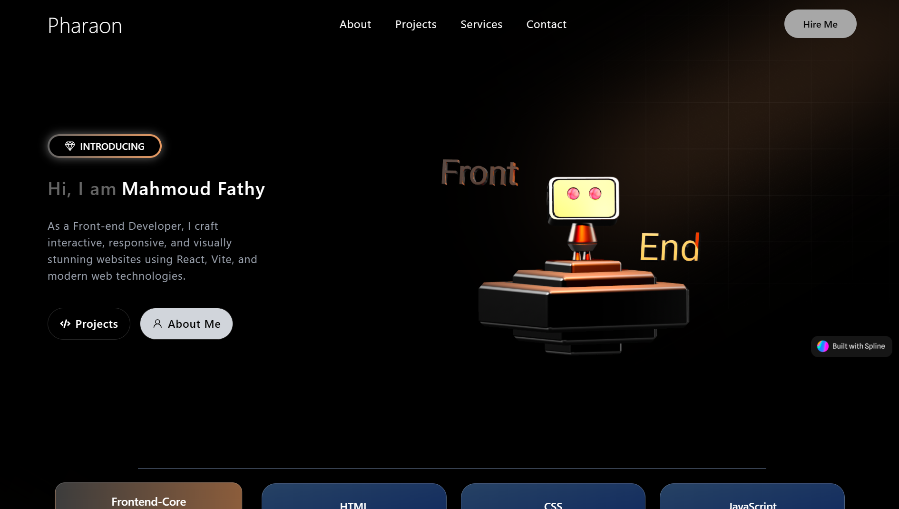
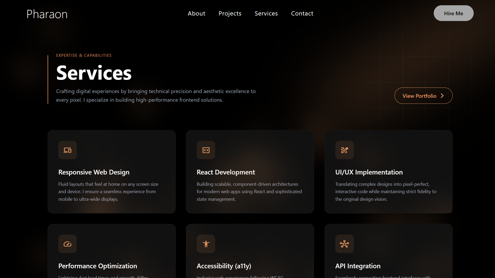

# 🎨 Mahmoud Fathy - Portfolio Website

> A modern, interactive 3D portfolio website showcasing frontend development expertise with stunning animations and visual effects.

[](https://reactjs.org/)
[](https://www.typescriptlang.org/)
[](https://vitejs.dev/)
[](https://tailwindcss.com/)

---

## 📸 Screenshots

### Home Page

*Interactive hero section with 3D robot animation and smooth scroll effects*

### About Page

*Comprehensive introduction with skills showcased through animated progress bars*

### Services Page

*Service offerings with dynamic floating bubbles and smooth hover animations*

### Projects Page

*Portfolio projects gallery with detailed project cards and interactive elements*

### Contact Page

*Contact form with social media links and professional contact information*

---

## ✨ Features

### 🎭 Stunning Visual Effects
- **3D Animations**: Interactive 3D robot model with Spline integration
- **Floating Bubbles**: Dynamic background effects with random movement and opacity changes
- **Smooth Transitions**: Framer Motion powered animations throughout
- **AOS Animations**: Scroll-triggered animations for enhanced user engagement

### 🎨 Modern Design
- **Dark Theme**: Sleek, professional dark mode design
- **Responsive Layout**: Fully responsive across all device sizes
- **Glassmorphism**: Modern UI elements with blur and transparency effects
- **Custom Color Scheme**: Curated orange (`#e99b63`) accent color palette

### 🚀 Performance Optimized
- **Fast Loading**: Built with Vite for lightning-fast development and builds
- **Code Splitting**: Optimized bundle size with lazy loading
- **TypeScript**: Type-safe codebase for better maintainability
- **Tailwind CSS**: Utility-first CSS for minimal bundle size

### 📱 Core Pages
1. **Home** - Hero section with 3D interactive robot and introduction
2. **About** - Personal introduction, skills, and expertise showcase
3. **Services** - Development services with floating bubble animations
4. **Projects** - Portfolio gallery with project details and live demos
5. **Contact** - Contact form and social media integration

---

## 🛠️ Technology Stack

### Core Framework
- **React 19.2.0** - Latest React with modern features
- **TypeScript 5.9.3** - Type-safe development
- **Vite 7.2.4** - Next-generation frontend tooling

### 3D & Animations
- **@splinetool/react-spline** - 3D interactive animations
- **@react-three/fiber** - Three.js renderer for React
- **@react-three/drei** - Useful helpers for 3D scenes
- **Framer Motion 12.25.0** - Animation library
- **AOS 3.0** - Animate On Scroll library

### UI & Styling
- **Tailwind CSS 3.4.19** - Utility-first CSS framework
- **React Icons 5.5.0** - Icon library
- **Swiper 12.0.3** - Touch slider for carousels

### Routing
- **React Router DOM 7.12.0** - Client-side routing

---

## 📦 Installation & Setup

### Prerequisites
- Node.js (v18 or higher recommended)
- npm or yarn package manager

### Quick Start

1. **Clone the repository**
```bash
git clone https://github.com/yourusername/portfolio3d.git
cd portfolio3d
```

2. **Install dependencies**
```bash
npm install
```

3. **Start development server**
```bash
npm run dev
```

4. **Open in browser**
```
http://localhost:5173
```

### Build for Production

```bash
npm run build
```

The optimized production build will be in the `dist` folder.

### Preview Production Build

```bash
npm run preview
```

---

## 📁 Project Structure

```
portfolio3d/
├── public/               # Static assets
│   └── images/          # Image assets
├── src/
│   ├── components/      # React components
│   │   ├── About/      # About page components
│   │   ├── Global/     # Shared components (Navbar, Footer)
│   │   ├── Home/       # Home page components
│   │   ├── Projects/   # Project components
│   │   ├── Services/   # Services components
│   │   └── UI/         # Reusable UI components
│   ├── pages/          # Page components
│   │   ├── Home.tsx
│   │   ├── About.tsx
│   │   ├── Services.tsx
│   │   ├── Project.tsx
│   │   ├── ProjectInfo.tsx
│   │   └── Contact.tsx
│   ├── types/          # TypeScript type definitions
│   ├── App.tsx         # Main app component
│   ├── main.tsx        # Entry point
│   └── index.css       # Global styles
├── tailwind.config.js  # Tailwind configuration
├── tsconfig.json       # TypeScript configuration
├── vite.config.ts      # Vite configuration
└── package.json        # Dependencies
```

---

## 🎯 Key Components

### FloatingBubbles
Dynamic background animation component with random movement and opacity changes:
- Random X and Y axis movement
- Varying sizes and scales
- Smooth opacity transitions
- Customizable count and color

### Navigation
Responsive navigation bar with:
- Smooth page transitions
- Active route highlighting
- Mobile-friendly design

### Project Cards
Interactive project showcases with:
- Hover animations
- Project details overlay
- Live demo links
- Technology stack badges

---

## 🎨 Customization

### Colors
The primary accent color is defined in Tailwind config and can be changed:
```javascript
// tailwind.config.js
colors: {
  primary: '#e99b63', // Orange accent
}
```

### Animations
Custom animations are defined in Tailwind config:
```javascript
keyframes: {
  floatBubble: {
    // Custom bubble animation
  }
}
```

---

## 🚀 Deployment

This project can be deployed to various platforms:

### Netlify
```bash
npm run build
# Deploy the 'dist' folder
```

### Vercel
```bash
vercel --prod
```

### GitHub Pages
```bash
npm run build
# Deploy the 'dist' folder to gh-pages branch
```

---

## 📝 Scripts

| Command | Description |
|---------|-------------|
| `npm run dev` | Start development server |
| `npm run build` | Build for production |
| `npm run preview` | Preview production build |
| `npm run lint` | Run ESLint |

---

## 🌟 Features Highlights

- ✅ **Fully Responsive** - Works seamlessly on desktop, tablet, and mobile
- ✅ **3D Interactive Elements** - Engaging 3D robot model
- ✅ **Smooth Animations** - Framer Motion and AOS integration
- ✅ **Type Safe** - Full TypeScript support
- ✅ **Fast Performance** - Optimized with Vite and code splitting
- ✅ **Modern UI/UX** - Clean, professional design with glassmorphism
- ✅ **SEO Ready** - Proper meta tags and semantic HTML
- ✅ **Accessible** - WCAG compliant components

---

## 📄 License

This project is open source and available under the [MIT License](LICENSE).

---

## 👨‍💻 Developer

**Mahmoud Fathy**
- Portfolio: [Your Website](https://yourwebsite.com)
- LinkedIn: [Your LinkedIn](https://linkedin.com/in/yourprofile)
- GitHub: [Your GitHub](https://github.com/yourusername)
- Email: your.email@example.com

---

## 🙏 Acknowledgments

- [Spline](https://spline.design/) - 3D design tool
- [React Three Fiber](https://docs.pmnd.rs/react-three-fiber) - 3D rendering
- [Framer Motion](https://www.framer.com/motion/) - Animation library
- [Tailwind CSS](https://tailwindcss.com/) - CSS framework
- [Vite](https://vitejs.dev/) - Build tool

---

<div align="center">
  Made with ❤️ by Mahmoud Fathy
</div>
