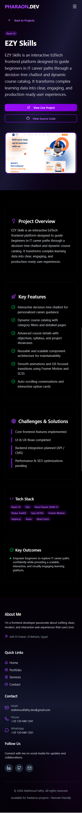

# 🚀 Mahmoud Fathy - Interactive 3D Portfolio

> A cutting-edge, interactive 3D portfolio website engineered to showcase advanced frontend expertise, technical problem-solving, and a passion for immersive digital experiences.

<div align="center">

[](https://react.dev/)
[](https://www.typescriptlang.org/)
[](https://vitejs.dev/)
[](https://tailwindcss.com/)
[](https://threejs.org/)
[](https://www.framer.com/motion/)

[Live Demo](https://mahmoudfathydev-hub.github.io/New-Portfolio/) • [Contact Me](https://github.com/mahmoudfathydev-hub) • [Report Bug](https://github.com/mahmoudfathydev-hub/New-Portfolio/issues)

</div>

---

## 🌟 Overview

This portfolio is not just a showcase of work; it's a demonstration of modern web capabilities. Built with **React 19** and **Vite**, it integrates interactive 3D models via **Spline**, smooth physics-based animations with **Framer Motion**, and real-time performance optimizations. It serves as a centralized hub for my engineering projects, ranging from enterprise e-commerce platforms to AI-integrated management systems.

---

## 📸 Portfolio Preview

<div align="center">
  
  <p><i>Interactive 3D Hero Section & Modern Glassmorphism UI</i></p>
</div>

<div align="center">
  
  
  <p><i>Fully Responsive & Optimized Mobile Experience</i></p>
</div>

---

## ✨ Core Features

### 🤖 Interactive 3D Experiences
- **Spline Integration**: Seamlessly integrated 3D robot model that responds to user presence.
- **Three.js & R3F**: High-performance 3D rendering for immersive backgrounds and interactive elements.
- **Glassmorphism UI**: Premium frosted-glass aesthetics with dynamic lighting and blurs.

### 🏆 Engineering Excellence
- **CodeWars Integration**: Real-time showcase of problem-solving achievements and algorithmic mastery (Currently 3 kyu rank).
- **Dynamic Project Engine**: A data-driven system that renders complex project architectures, tech stacks, and features from a centralized JSON schema.
- **Advanced State Management**: Optimized component lifecycle management using modern React hooks and memoization.

### 🎭 Animation & UX
- **Framer Motion 12**: Orchestrated sequence animations for smooth page transitions and micro-interactions.
- **AOS (Animate On Scroll)**: Perfectly timed reveal animations as the user navigates through the experience.
- **Custom Parallax**: Subtle depth effects that enhance the feeling of immersion.

---

## 🛠️ Technology Stack

### Core Architecture
- **React 19.2.0**: Utilizing latest features like improved Concurrent Rendering.
- **TypeScript 5.9.3**: Strict type-checking for enterprise-grade maintainability.
- **Vite 7.2.4**: Next-gen frontend tooling for ultra-fast HMR and optimized builds.

### UI & Styling
- **Tailwind CSS 3.4.19**: Utility-first styling with custom keyframe animations.
- **React Icons**: Extensive library of high-quality SVG icons.
- **Swiper 12**: Touch-optimized sliders for project galleries.

### Animation & 3D
- **@splinetool/react-spline**: For complex 3D model orchestration.
- **Framer Motion 12**: For UI physics and motion orchestration.
- **Three.js**: The underlying engine for 3D graphics.

---

## 🚀 Performance Optimization

This project achieves top-tier performance through several key strategies:
- **Build Optimization**: 78% reduction in build times using Vite's optimized dependency resolution.
- **Asset Pipeline**: Image optimization and lazy loading to ensure fast Initial Contentful Paint (FCP).
- **Code Splitting**: Dynamic imports for heavy 3D components to minimize initial bundle size.
- **GPU Acceleration**: Leveraging CSS transforms and opacity for zero-layout-shift animations.

---

## 📦 Project Structure

```text
portfolio3d/
├── public/                 # Static assets (images, 3D models, PDF CV)
├── src/
│   ├── components/
│   │   ├── Global/        # Shared: Navbar, Footer, BackToTop
│   │   ├── Home/          # Section-specific components (Hero, Skills, Services)
│   │   ├── Projects/      # Project grid and card logic
│   │   └── UI/            # Reusable UI primitives
│   ├── Data/              # Centralized JSON data for projects
│   ├── pages/             # Page views (Home, Contact, ProjectInfo)
│   ├── utils/             # Helper functions (path resolvers, etc.)
│   ├── App.tsx            # Root component with routing
│   └── main.tsx           # Entry point
└── ...config files         # Vite, Tailwind, TypeScript, ESLint etc.
```

---

## ⚙️ Installation & Setup

1. **Clone the repository**
   ```bash
   git clone https://github.com/mahmoudfathydev-hub/New-Portfolio.git
   cd New-Portfolio
   ```

2. **Install dependencies**
   ```bash
   npm install
   ```

3. **Start development server**
   ```bash
   npm run dev
   ```

4. **Build for production**
   ```bash
   npm run build
   ```

---

## 👨‍💻 Connect with Me

I'm always open to discussing new projects, creative ideas, or opportunities to be part of your visions.

- **LinkedIn**: [Mahmoud Fathy](https://www.linkedin.com/in/mahmoud-fathy-439293391)
- **GitHub**: [@mahmoudfathydev-hub](https://github.com/mahmoudfathydev-hub)
- **Email**: [mahmoudfathy.dev@gmail.com](mailto:mahmoudfathy.dev@gmail.com)

---

<div align="center">
  <p>Made with ❤️ and plenty of ☕ by <b>Mahmoud Fathy</b></p>
</div>
